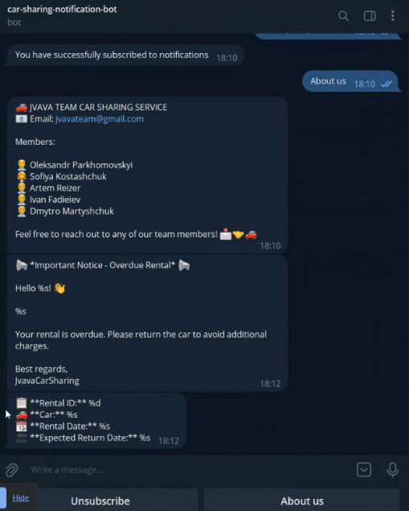
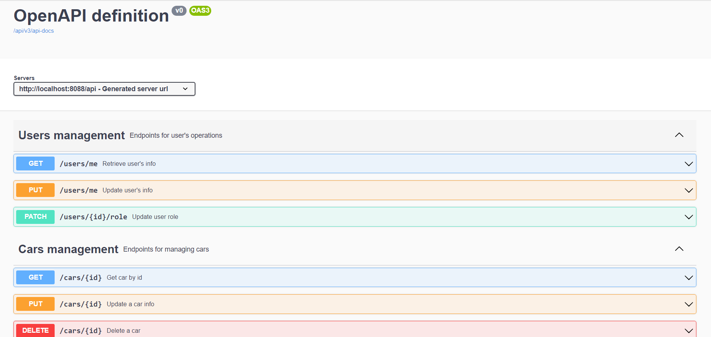
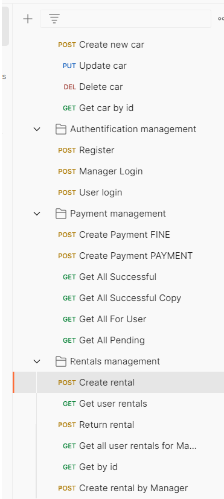
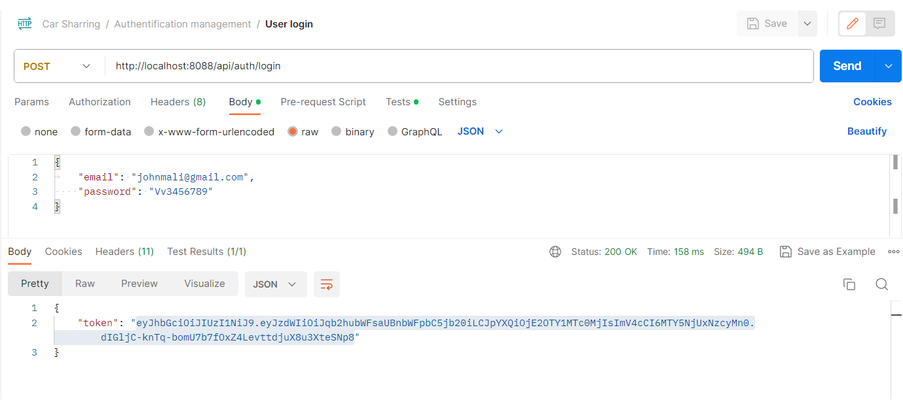
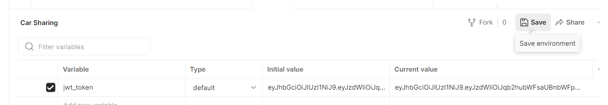
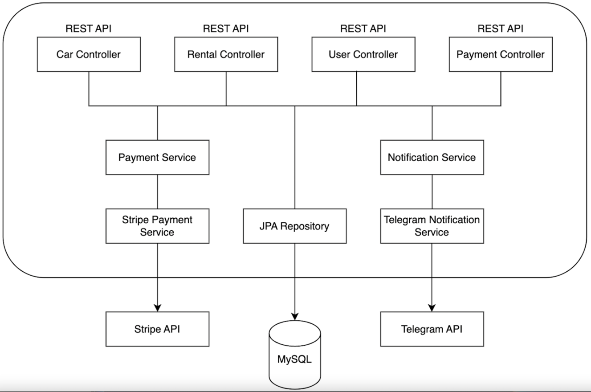

# Car Sharing Service
<span style="font-size: 24px; color: #ca9a38">Online Car Rental Management System</span>

<div style="display: flex; justify-content: center;">
    <span style="display: inline-block; border: 5px solid #30558a; border-radius: 25px; padding: 7px;">
        
    </span>
</div>


## Introduction

Welcome to the Car Sharing Service, an online platform for managing car rentals.
This system simplifies the process of renting cars, managing inventory,
and handling payments.

<div style="display: flex; justify-content: center;">
    <span style="display: inline-block; border: 5px solid #30558a; border-radius: 25px; padding: 7px;">
        
    </span>
</div>

Whether you're a customer looking to rent a car or an administrator overseeing the service, this README will guide you through the key aspects of our application.


## Table of Contents

- [Technologies and Tools](#technologies-and-tools)
- [Functionalities](#functionalities)
- [Getting started](#getting-started)
- [Swagger Documentation](#swagger-documentation)
- [Postman](#postman)
- [Controllers](#controllers)
- [Architecture](#architecture)
- [Project Structure](#project-structure)
- [Contacts](#contacts)

## Technologies and Tools

This application is built using the following technologies and tools:

- **Spring Boot**: For rapid application development.
- **Spring Security**: Ensuring the security and authentication of users.
- **Spring Data JPA**: Simplifying database operations.
- **Swagger**: Providing API documentation for developers.
- **Stripe**: Facilitating online payments.
- **Telegram API**: Sending notifications.
- **Docker**: Containerization for easy deployment.
- **AWS**: Hosting the application.

## Functionalities

Our application offers the following functionalities:

- **Car Inventory Management**: Add, update, and delete cars. Check car availability.
- **User Profiles**: Register and manage user profiles, including role updates.
- **Rental Management**: Rent cars by manager or user, return rentals, and view rental history.
- **Payment Integration**: Make payments online using Stripe.
- **Notifications**: Receive notifications about new rentals, overdue rentals, and successful payments.

## Getting started

### Database Configuration


1. **Database Configuration**:

   Create a `.env` file in the root directory of your project to store sensitive database configuration details. Use the following template and replace the placeholder values with your own:

   ```dotenv
   MYSQL_ROOT_PASSWORD=SuperStrongPassword
   # Database Configuration
    # Database Configuration
    MYSQL_ROOT_PASSWORD=SuperStrongPassword
    MYSQL_USER=admin
    MYSQL_PASSWORD=StrongPassword1234
    MYSQL_DB=car_sharing_app
    MYSQL_LOCAL_PORT=3307
    MYSQL_DOCKER_PORT=3306
    MYSQL_PING_CHECK=mysqladmin ping -u root -p${MYSQL_ROOT_PASSWORD}
    
    # Spring Boot Configuration
    SPRING_LOCAL_PORT=8088
    SPRING_DOCKER_PORT=8080
    DEBUG_PORT=5005
    
    # Telegram Bot Configuration
    TELEGRAM_BOT_NAME=YourTelegramBotName
    TELEGRAM_BOT_TOKEN=YourBotToken
    
    # Stripe Configuration
    STRIPE_SECRET_KEY=YourStripeSecretWord


To simplify deployment and management of this application, using Docker is recommended.\
Docker allows you to build, package, and run this application in containers, making the deployment process straightforward and repeatable.

### Installing Docker

If Docker is not already installed on your computer, you can download it from the [official Docker website](https://www.docker.com/get-started).

### Deploying the Application with Docker

To deploy this application with Docker, follow these steps:

2. Build the Docker image using the provided Dockerfile in the project's root directory:

   ```bash
   docker compose build

3. Run the container with the built image:
    ```bash
    docker compose up

4. Your application is now accessible at http://localhost:8088.

Additional Docker Commands
To view a list of active containers, use:\
`docker ps`

To stop a container, use:\
`docker stop bookstore`

After starting the application, you can access the API documentation and endpoints at
[Swagger Documentation](http://localhost:8088/api/swagger-ui/index.html).\
Or Postman with [this](Car_sharring_postman_collection.json) collections.

## Swagger Documentation

API documentation is available via Swagger.\
You can access it by clicking [here](http://localhost:8088/api/swagger-ui/index.html).\
Swagger provides detailed information about API endpoints, request parameters, and responses, making it easy for developers to explore and understand the API.



## Postman

For an even easier understanding of API endpoints, you can explore our Postman collection.\
Import the [Postman](Car_sharring_postman_collection.json) collection you will find in project structure 
to your postman and explore different endpoints:

(use http://localhost:8088 port for access to docker)


<span style="display: inline-block; border: 5px solid #38ca75; border-radius: 25px; padding: 7px;">

</span>

Login after registration:\
<span style="display: inline-block; border: 5px solid #38ca75; border-radius: 25px; padding: 7px;">

</span>


Set jwt token to your environment and click "Save":

<span style="display: inline-block; border: 5px solid #38ca75; border-radius: 25px; padding: 7px;">

</span>

Test different operations!

## Controllers

Our application has the following controllers:

- **Authentication Controller**: Register and login users.
- **Users Controller**: Manage user profiles and roles.
- **Cars Controller**: Manage car inventory.
- **Rentals Controller**: Handle car rentals.
- **Payments Controller (Stripe)**: Facilitate online payments.
- **Notifications Service (Telegram)**: Send notifications.

## Architecture



## Project Structure

The project is organized as follows:

- `.github`: Configuration files for GitHub.
- `.idea`: Configuration for IntelliJ IDEA.
- `.mvn`: Maven configuration files.
- `paintings`: Directory for README.md graphics.
- `src`: The main directory for the Java source code.
    - `main`: The main application code.
        - `java`: The Java source code.
            - `carsharingapp`: The root package for the application.
                - `config`: Configuration classes for the application.
                    - `MapperConfiguration`: Mapper configuration.
                    - `SecurityConfig`: Security configuration.
                    - `TelegramBotConfiguration`: Configuration for the Telegram bot.
                - `controller`: Controllers for various functionalities, serving as the application's entry point.
                    - `AuthController`: Authentication controller.
                    - `CarController`: Car-related operations controller.
                    - `HealthController`: Health check controller.
                    - `PaymentController`: Payment-related operations controller.
                    - `RentalController`: Rental-related operations controller.
                    - `UserController`: User-related operations controller.
                - `dto`: Data Transfer Objects (DTOs) used for requests and responses.
                - `exception`: Custom exceptions and exception handling.
                    - `EntityNotFoundException`: Custom exception for entity not found.
                    - `GlobalExceptionHandler`: Global exception handler.
                    - `InvalidRequestParametersException`: Custom exception for invalid request parameters.
                    - `PaymentException`: Custom exception for payment-related errors.
                    - `RegistrationException`: Custom exception for registration errors.
                    - `TelegramBotException`: Custom exception for Telegram bot errors.
                - `mapper`: Mapper classes for converting between entities and DTOs.
                    - `car`: Car-related mappers.
                    - `payment`: Payment-related mappers.
                    - `rental`: Rental-related mappers.
                    - `user`: User-related mappers.
                - `model`: Entity classes representing database tables.
                    - `Car`: Car entity.
                    - `Payment`: Payment entity.
                    - `Rental`: Rental entity.
                    - `Role`: Role entity.
                    - `Subscription`: Subscription entity.
                    - `User`: User entity.
                - `notification`: Notification service implementations.
                    - `impl`: Implementation classes for notifications.
                        - `TelegramNotificationService`: Telegram notification service.
                    - `telegram`: Telegram-related interfaces and classes for notifications.
                        - `NotificationService`: Notification service interface.
                - `payment`: Payment-related classes.
                    - `calculator`: Payment calculator classes.
                        - `PaymentService`: Payment service interface.
                        - `PaymentServiceImpl`: Implementation of the payment service.
                - `repository`: Data repositories for database operations.
                    - `car`: Car-related repositories.
                    - `payment`: Payment-related repositories.
                    - `rental`: Rental-related repositories.
                    - `subsription`: Subscription-related repositories.
                    - `user`: User-related repositories.
                - `security`: Security-related classes and authentication filters.
                    - `AuthenticationService`: Authentication service.
                    - `CustomUserDetailsService`: Custom user details service.
                    - `JwtAuthentificationFilter`: JWT authentication filter.
                    - `JwtUtil`: JWT utility class.
                  - `service`: Service implementations and interfaces.
                    - `CarService` managing car inventory and availability
                    - `RentalService`  responsible for managing car rentals in the Car Sharing Service
                    - `SubscriptionService` managing user subscriptions
                    - `UserService` handles user authentication, registration, and profile management
        - `resources`: Configuration and resource files.
    - `test`: Directory containing integration test classes.
    - `db-scripts`: SQL scripts for setting up the database during testing.
    - `application.properties`: Application properties for tests.


### Development Setup

- Trello board for task management.
- GitHub organization created.
- CI process configured.
- Liquibase support added.
- Health check controller implemented.
- Docker and docker-compose support added.
- Swagger documentation implemented.

### Challenges Faced

During the project's development,
we gained valuable insights into collaborative teamwork.

We successfully managed tight deadlines,
emphasizing effective time management.\
Our team utilized Trello as a powerful tool for task management,
enabling seamless coordination and efficient project execution.\
Additionally, we acquired new knowledge in handling online notifications and managing financial transactions.

## Contacts

For any inquiries or support, please contact us at [jvavateam@gmail.com](mailto:jvavateam@gmail.com).
